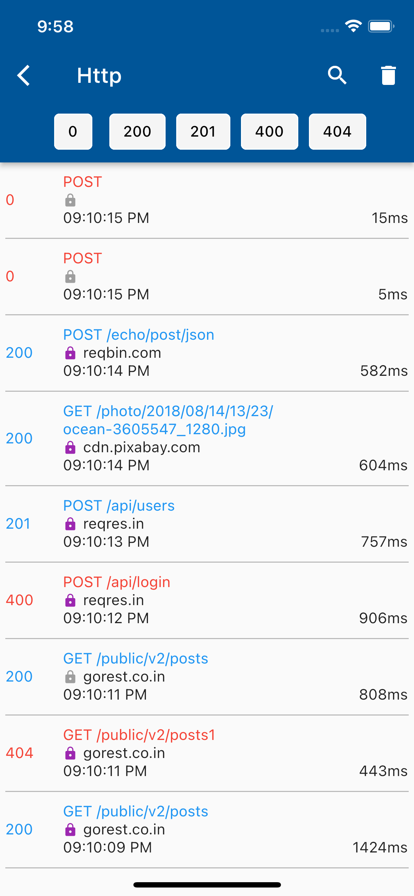
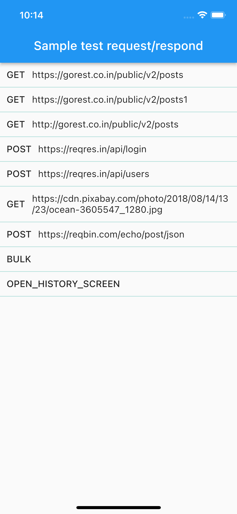

# HttpCallViewer

A Flutter package that inspects http call requests, responses which made by [dio package](https://pub.dev/packages/dio). This package show notifications on each call and UI screen.

## Features

- Show notification on each http call
- Show history http call list, and call detail in UI screen
- Copy http call detail to clipboard

##### Under construction:

- Export http call to postman format or open api

<table>
  <tr>
      <td>
        
      </td>
      <td>
        
      </td>
    </tr>
 </table>

## Getting Started

### Add dependencies

```yaml
dependencies:
  e_http_inspector: ^1.0.0
```

## Usage

### Config and use in application

Init EHttpInspector with _dio instance, MaterialApp's _navigatorKey and some configuration for notifications.

```dart
void main() async {
  await EHttpInspector.init(_dio, _navigatorKey, "<Your channel key>", "<Your channel name>",
        "Your channel description");
  runApp(const MyApp());
}
```

Or init EHttpInspector with dio and config notification in separated step
```dart
  //Somewhere in your api client
  _dio = Dio();
  await EHttpInspector.initInterceptor(_dio);
```
```dart
  //In your main.dart
  GlobalKey<NavigatorState> navigatorKey = GlobalKey();

  void main() async {
     await EHttpInspector.initNotification(navigatorKey, "<Your channel key>", "<Your channel name>",
                "Your channel description");
    runApp(const MyApp());
  }

  //Somewhere in your app ui. For ex: app.dart
  MaterialApp(
    key: appKey,
    navigatorKey: navigatorKey,
    // other UI code
  )
```

Open http call history screen by using
```dart
    EHttpInspector.openHttpHistoryScreen()
```


## Issues and feedback

Create issues and add appropriate label on Github issues or into our [mailing list]
For more detail see [CONTRIBUTING](CONTRIBUTING.md)

## Contributor

- [Justin Lewis](https://github.com/justin-lewis) (Maintainer)
- [Chau VP](https://github.com/chauvu1000) (Developer)

## License

[MIT](LICENSE)

[mailing list]: https://groups.google.com/g/ehttpinspector-group

